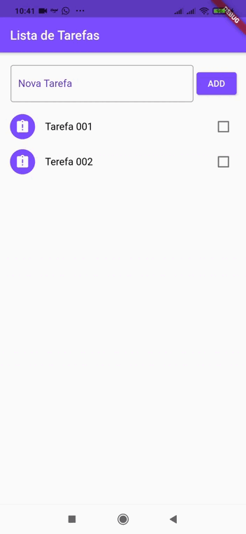

# APP Lista de Tarefas (APP to-do List) Flutter/Dart

 ### Projeto destinado exclusivamente em melhorar minhas habilidades com Flutter e Dart

 Criação de APP simples de Listas de Tarefas utilizando **Flutter/Dart** 

 

 
 

### Download do Aplicativo (APK)
Faça o download do arquivo APK do app e instale-o em seu smartphone.

  <a href="">[ Download App ]</a>

## Aprendizado

* Utilização do plugin `path_provider` para salvar e ler arquivos na memória interna do dispositivo.
* Utilização de widgets como: *Dismissible*; *CheckboxListTile*; *SnackBar*; *RefreshIndicator*.
* Ordenação de listas.
* Utilização de `setState`.
